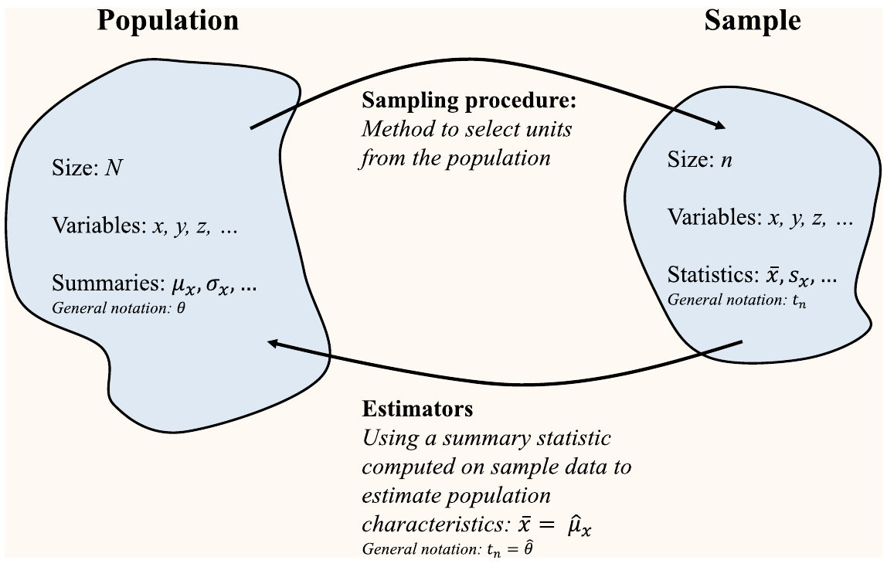

```{r setup, include=FALSE}
library(knitr)
require(tidyverse)
set.seed(453)
# invalidate cache when the package version changes
knitr::opts_chunk$set(tidy = FALSE, echo = FALSE, 
                  message = FALSE, warning = FALSE,
                  out.width = "45%")
options(knitr.table.format = "latex")
options(knitr.kable.NA = "", digits = 2)
options(kableExtra.latex.load_packages = FALSE)

# set penalty for using scientific notation at 10, and number of digits to use in notation to 10
options(scipen = 30, digits = 15)

theme_set(theme_bw())
```

# Statistics: Origin and Meaning

## Meaning

\begin{columns}
\column{0.8\textwidth}

\begin{itemize}
\small
\item Statistics must have started as a state arithmetic to assist a rural who neeeded to know the wealth and numbers of other properties in order to levy tax.
\item Gambling as games of chance to the theory of probability about the middle of seventh century.
\item Statistical principles involve certain logical patterns, methods of reasoning and critical thinking. Using the logical reasoning we draw conclusions based on incomplete information about a phenomenon. The Theory of Probability is used for this purpose. Thus there is a linkage between probability theory and statistical principles.
\item A branch of mathematics dealing with the collection, analysis, interpretation, and presentation of masses of numerical data (Merriam webster)
\item In statistics, a single value has no meaning. At least two observations must be needed for statistical analysis. The statistics deals with group of individuals -- populations -- not a single object.
\end{itemize}
\column{0.2\textwidth}

```{r statistical-lamppost, out.width="70%", fig.cap="Statistical lamp-post"}

```

\end{columns}

<!-- (Refer to Chapter 6 on 'An informal history of statistics', Plant Breeding Reviews, Volume 17.) -->

##

\begin{block}{Definition}
Statistics can be defined as the body of concepts, examples and methods dealing with collection, summarization, analysis and interpretation of data. -- R. Rangaswamy, 1995 \\[0.5cm]
Statistics is the science, pure and applied, of developing and applying the techniques to deal with quantitative and qualitative information, such that uncertainity of inductive inference may be evaluatated. -- Steel and Torrie, 1960.
\end{block}

## Branches of statistics

- Organizing and summarizing data is called **descriptive** statistics. 
- Two ways to summarize data are by graphing and by using numbers (for example, finding an average). 
- After you have studied probability and probability distributions, you will use formal methods for drawing conclusions from "good"data. The formal methods are called **inferential** statistics.

## Aims of statistics

- To study population
- To quantify the variation and study its causes; and
- To study the methods of summarizing/reduction data

## Scope of statistics

\small

- Historically, kings and chiefs of states were using statistics in framing suitable military and fiscal policies, imposing taxes and maintaining law and order for the welfare of state. 
- Vast governmental statistical activities are in operation for collection and dissemination of data such as national population census, economic affairs, national production, input-output accounts, balance payments, measures of past trends, current status and future projections.
- These days statistical methodology is employed by investigators in virtually all disciplines, including such areas as:
  \begin{itemize}
  \footnotesize
  \item business enterprises (production/purchase planning, marketing and quality control decision making)
  \item molecular biology (analysis of microarray data)
  \item ecology (describing quantitatively how individuals in various animal and plant populations are spatially distributed)
  \item materials engineering (studying properties of various treatments to retard corrosion) marketing (developing market surveys and strategies for marketing new products)
  \item public health (identifying sources of diseases and ways to treat them) 
  \item civil engineering (assessing the effects of stress on structural elements and the impacts of traffic flows on communities)
  \end{itemize}

## Limitations of statistics

- Statistics does not deal with an individual
- It does not study qualitative characters
- It does not reveal the entire story
- It is true only on an average
- It is liable to be misused, and
- Statistical theories can be applied only when there is variability in the experimental materials.

## Steps/procedures in statistics

- Collection of the data: From primary and secondary source.
- Organization/presentation of data: It is based on, 
  - Classification: Process by which the individual item of any data are arranged in different groups or classes according to resemblances and similarities in relation to any variable characters. e.g., diagrams, pictures and graphs.
  - Tabulation: The process by which the classified data are presented in an orderly manner by being placed in proper rows and columns of a table in order to bring out their chief characteristics and essential features.
- Analysis of data: Includes but not limited to measures of central tendency and measures of variation.
- Interpretation of the analysed data.

# Data

##

\begin{itemize}
\small
\item \alert{Statistics}
  \begin{itemize}
  \footnotesize
  \item the practice or science of collecting and analysing numerical data in large quantities, especially for the purpose of inferring proportions in a whole from those in a representative sample.
  \item According to statistics compiled by NoC, average gas prices in Nepal topped out in July at NRs. 180 per liter.
  \end{itemize}
\item Data (singular: \textit{datum})
  \begin{itemize}
  \footnotesize
  \item coding or representation of existing information or knowledge in some form suitable for processing.
  \item the quantities, characters, or symbols on which operations are performed by a computer, which may be stored and transmitted in the form of electrical signals and recorded on magnetic, optical, or mechanical recording media.
  \end{itemize}
\item Data types
  \begin{itemize}
  \footnotesize
  \item Categorical
    \begin{itemize}
    \scriptsize
    \item Nominal
    \item Ordinal
    \end{itemize}
  \item Quantitative: Show tendency to concentrate at certain values, usually somewhere in centre of the distribution (called measures of central tendency). The data varies about a measure of central tendency (called measures of \textit{variation} or \textit{dispersion}). The measures of the direction and degree of asymmetry of data in frequency distribution are called measures of \textit{skewness}. Also exhibit flatness or peakedness of frequency curves (called measures of \textit{kurtosis}).
    \begin{itemize}
    \scriptsize
    \item Discrete
    \item Continuous
    \end{itemize}
  \end{itemize}
\end{itemize}

## Based on the method of collection

- Primary data: Data are collected from the field by investigator himself directly.
- Secondary data: Secondary data are the data that already exist. The researcher or investigator obtain them form various sources such as through mail, middle man, reports and publications.

# Population and sample

##

- A \alert{\textit{unit}} is usually a concrete or physical thing for which we would like to measure its characteristics.
  - in medical and social sciences -- human beings
  - in industry -- products
  - in marketing -- sales
  - in experimental field -- ...
- The complete set of units that we would like to say something about is called the (target) \alert{population}.
- The set of units for which we have obtained data is referred to as the \alert{sample}.

\footnotesize
- The population is the complete collection of subjects whose study is of interest.
- **Population** refers to an aggregate of individual possessing the specified characteristics.
- A sample is a part of the population of interest, a subset selected by some means from the population.
- The sample is drawn from the population systematically or randomly. The size of the sample is denoted by "n" and the size of populaiton is denoted by "N". Every small part of a population is not a sample; only the part that is scientifically selected is known as sample. Individuals comprising a sample must be chosen unbiased.

##

<!-- Source: http://www.leg.ufpr.br/~walmes/tikz/ -->

\begin{tikzpicture}
  \path[mindmap, concept color=darkgreen, text=white]
  node[concept] {Demonstration plots of Rice varieties for Hill ecology} [clockwise from=180]
  child[concept color=darkgreen!50, black] {
    node[concept] {Variety 1, Variety 2, Variety 3}
  }
  child[concept color=darkgreen!70!blue, black] {
    node[concept] {Variety 3, Variety 4, Variety 8}
  }
  child[concept color=darkgreen!70!orange, black] {
    node[concept] {Variety 4, Variety 5, Variety 7}
  }
  child[concept color=darkgreen!70!purple, black] {
    node[concept] {Variety 2, Variety 1, Variety 8}
  };
\end{tikzpicture}

##

```{r population-sample, fig.align='center', out.width="80%"}
# pdftools::pdf_convert("../text-scientific/Kaptein M. Statistics for Data Scientists. An Introduction 2022.pdf", pages = 65, format = "png", dpi = 250, filenames = "./images/population_vs_sample.png")

```

##

\begin{description}[longest label]
\small
\item[Parameter] A numerical value that describes a characteristic of a population.
\item[Statistic] A numerical measurement that describes a characteristic of a sample.
\end{description}

\footnotesize
- Before gathering data, we first consider the scope of our study by identifying the population. The population consists of all subjects/animals/specimens/plants, and so on, of interest.
  \begin{itemize}
  \footnotesize
  \item All poplar trees in Tikapur
  \item All people in Nepal with the height above 155 cm
  \end{itemize}
- Typically, we are unable to observe the entire population; therefore, we must be content with gathering data from a subset of the population, a sample of size $n$. From this sample we make inference about the population as a whole.
- Note the difference between biological meaning of individual sample (specimen) and the same term used in statistics.

## Variables

\begin{description}[longest label]
\item[Variables] A quantitative and qualitative characteristic that varies from observation/unit to observation/unit in the same group.
\item[Continuous variables] The variables for which fractional measurements are possible are termed as continuous variables. For example, In the range of 5 kgs-6 kgs yield of crop, the actual yield might be 5.12 or 5.43 kg.
\item[Discrete/Discontinuous variables] The variables for which fractional measurements are not possible are called as discrete/discontinuous variables. For example, the number of grains per panicle of paddy can be counted in full numbers only like 80, 81, 82, etc. Discrete variables can further be classified into nominal and ordinal types. Nominal variables cannot be measured numerically, e.g., education, sex, honesty, etc. Ordinal variables can be numerically ordered. e.g., height as tall, medium and dwarf.
\end{description}

\footnotesize
- The variables, continuous or discrete are denoted by capital letters like "X" and "Y".
- Conventionally, the qualitative variables are termed as variables and quantitative variables are termed as attributes.

##

\begin{description}[longest label]
\item[Variate] Each individual figure is known as variate, that varies from individual to individual.
\item[Variants] An individual observation or value of any variable is known as variants.
\item[Accurate] Very close to the population parameter.
\item[Precise] It is the higher degree of repeatablility.
\item[Statistic] A value calculated from a sample to estimate a population parameter is called as statistic.
\item[Deviation] The difference between the observation and the mean, i.e., between two values.
\end{description}
	
# Samping methods

##

- Refer to kaptein textbook (Statistics for Data Scientists)

## Simple random sampling

\begin{columns}[T,onlytextwidth]
\column{0.7\textwidth}
\begin{itemize}
\small
\item A simple random sample of $n$ items is a sample in which 
  \begin{itemize}
  \small
  \item every number of the population has the same chance of being included in the sample, and 
  \item the members of the sample are chosen independently of each other.
  \end{itemize}
\item Second requirement means that the chance of a given member of the population being chosen does not depend on which other members are chosen.
\end{itemize}

\footnotesize
For example, suppose you want to select a sample of size $n = 2$ from a population containing $N = 4$ objects. If the four objects are identified by the symbols $x_1, x_2, x_3$ and $x_4$, there are six distinct pairs that could be selected, as listed in Table \ref{tab:srs-sample-space}. If the sample of $n = 2$ observations is selected so that each of these six samples has the same chance of selection, given by $\frac{1}{6}$, then the resulting sample is called a simple random sample, or just a random sample.

\column{0.3\textwidth}

```{r srs-sample-space}
# expand_grid(two = c("x1", "x2"))

combn(c("$x_1$", "$x_2$", "$x_3$", "$x_4$"), m = 2) %>% 
  t() %>%
  as_tibble(function(x)janitor::make_clean_names(x,case = "lower_camel")) %>% 
  unite(col = "Observations in sample", sep = " ") %>% 
  mutate(Sample = row_number()) %>% 
  select(Sample, everything()) %>% 
  knitr::kable(booktabs = TRUE, escape = FALSE, caption = "Sample combinations of $n=2$ from a population containing $N=4$") %>% 
  kableExtra::kable_styling(font_size = 7)
```

\end{columns}


## Example Problem

A population contains 50,000 voters. Use the random number table to identify the voters to be included in a random sample of $n=15$.

<!-- For a example case of simple random sampling that uses random number generator, refer @mendenhall2009introduction (13th edition, pp 256).  -->

<!-- Source: @mendenhall2009introduction, pp 259 -->

## Probability proportional to size sampling

In probability proportional to size sampling the selection probability for each element is set to be proportional to its size measure, up to a maximum of 1.

Example: Suppose we have six schools with populations of 150, 180, 200, 220, 260, and 490 students respectively (total 1500 students), and we want to use student population as the basis for a PPS sample of size three. To do this, we could allocate the first school numbers 1 to 150, the second school 151 to 330 (= 150 + 180), the third school 331 to 530, and so on to the last school (1011 to 1500). We then generate a random start between 1 and 500 (equal to 1500/3) and count through the school populations by multiples of 500. If our random start was 137, we would select the schools which have been allocated numbers 137, 637, and 1137, i.e. the first, fourth, and sixth schools.

The PPS approach can improve accuracy for a given sample size by concentrating sample on large elements that have the greatest impact on population estimates.

## Stratified random sampling

When the population consists of two or more subpopulations, called strata, a sampling plan that ensures that each subpopulation is represented in the sample is called a **stratified** random sample.

National polls usually involve some form of stratified random sampling with states as strata, and state polls involve sampling technique using districts or municipalities as strata. 

## Systematic sampling

Sometimes the population to be sampled is ordered, such as an alphabetized list of people with driver's licenses, a list of utility users arranged by service addresses, or a list of customers by account numbers. In these and other situations, one element is chosen at random from the first k elements, and then every k-th element thereafter is included in the sample. This comprises a **1-in-k systematic random sample**.

## Cluster sampling

When the available sampling units are group of elements, random sampling performed on such units comprise a culstered sampling. For example, a household is a cluster of individuals living together. When a particular cluster is included in the sample, a census of every element in the cluster is taken.

```{r cluster-sampling, fig.align='center', out.width="45%"}
knitr::include_graphics("./images/cluster_sampling.png")
```

## Multistage sampling

## Sampling error

# Sampling in agricultural research

##

An experiment with 30 indigenous and exotic collections/cultivars of garden pea was conducted at Division of Vegetable crops, IARI, New Delhi during 1998. There were approximately 300 plants per plot. The characters observed were the day of appearance of first flower, first flowering node number, length of internodes, the day of 50% flowering, the day of first green pod harvest, number of primary branches, the length of pod, plant height, etc. It was not possible to take observation on 300 plants for each character. For convenience, the measurements were made only from 10 plants out of 300 plants in each of the plots for characters mentioned above.

One may also count tiller numbers only 1 msq of the 15 msq plot, for leaf area, measure from only 20 of the approximately 2000 leaves in the plot, etc.

##

For *plot sampling* (selection of some plants from a plot), number of plants in each plot is a population. The character under study is estimated from some selected plants. The selected plants are known as a sample. An appropriate sample is one that provides an estimate, or a sample value, that is as close as possible to the value that would have been obtained had all plant in the plot been measured -- the plot value. The difference between the sample value and the plot value constitutes the sampling error.

To develop a plot sampling technique for measurement of a character in a given trial, we must specify the sampling unit, the sample size, and the sampling design.

##

The sampling unit is the unit on which actual measurement is made. Some commonly used sampling units in a replicated field trial are a leaf, a plant, a group of plants, a unit area etc.

The number of sampling units taken from the population is known as sample size. The required sample size for a particular experiment is governed by:

i. The size of the variability among sampling units within the same plot (sampling variance).
ii. The degree of precision desired for the character of interest.

In practice, the size of the sampling variance for most plant characters is generally not known. However, its value can be estimated or assumed to be known. The desired level of precision can, however, be prescribed by the researcher based on experimental objective and previous experience, in terms of the marign of error, either of the plot mean or of the treatment mean.

##

The sample size for a simple random sampling design that can satisfy a prescribed margin of error of the plot mean is computed as:

$$
n = \frac{Z_{\alpha/2}^2 \times v_s}{d^2 \times \bar{X}^2}
$$

Where, n is the required sample size, $Z_{\alpha/2}$ is the value of the standardized normal variate corresponding to level of significance $\alpha$, $v_s$ is the sampling variance, $\bar{X}$ is the mean value, and d is the margin of error expressed as a fraction of the plot mean.

##

\footnotesize
The information of primary interest to the researcher is usually the treatment means (the average over all plots receiving the same treatment) or actually the difference of means, rather than plot mean (the value from a single plot). Thus, the desired degree of precision is usually specified in terms of the margin of error of the treatment mean rather than that of the plot mean. In such a case, sample size is computed as:

$$
n = \frac{Z_{\alpha/2}^2 v_s}{r D^2 \bar{X^2} - Z_{\alpha/2}^2 v_p}
$$

Where, n is the required sample size, r is the number of replications, $Z_{\alpha/2}$ and $v_s$ are as defined earlier, $v_p$ is the variance between plots of the same treatment (i.e. experimental error), and D is the prescribed margin of error expressed as a fraction of the treatment mean. In this case, additional information on the size of the experimental error ($v_p$) is needed to compute the sample size.

A sampling design specifies the manner in which the $n$ sampling units are to be selected from the whole plot. Most commonly used sampling designs in replicated field trials are detailed herein.

## General practices in sampling

Precision of a sample estimate generally increases with the size of the sampling unit, sample size, and the complexity of the sampling design used. However, an increase in either the size or the number of sampling units always increases the cost. Therefore, a proper balance has to be maintained between the size of the sampling unit, sample size and a sampling design on one hand and the cost at the other. This requires the information on the variability of the character of interest so that the precision that will result from the various types of sampling techniques can be estimated. There are three sources of the data from which the required information can be obtained: i. from previous trials, ii. additional data from ongoing experiments, or iii. specifically planned sampling studies.


# Bibliography

## References
