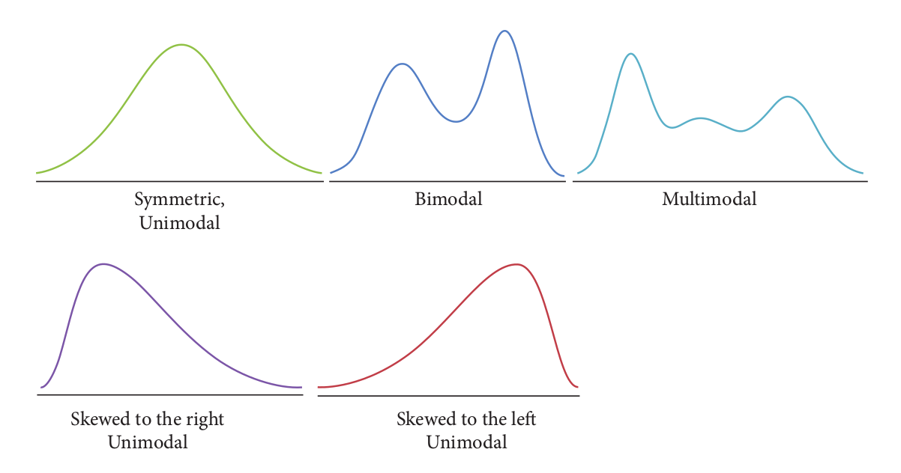

```{r setup, include=FALSE}
library(knitr)
require(tidyverse)
set.seed(453)
# invalidate cache when the package version changes
knitr::opts_chunk$set(tidy = FALSE, echo = FALSE, 
                  message = FALSE, warning = FALSE,
                  out.width = "45%")
options(knitr.table.format = "latex")
options(knitr.kable.NA = "", digits = 2)
options(kableExtra.latex.load_packages = FALSE)

# set penalty for using scientific notation at 10, and number of digits to use in notation to 10
options(scipen = 30, digits = 15)

theme_set(theme_bw())
```

# Measures of central tendency

## 

\small
- **Descriptive statistics** are statistics that describe a set of data.
- For quantitative data
  - They show a tendency to concentrate at certain values, usually somewhere in centre of the distribution. Measures of this tendency are called measures of central tendency or averages.
  - The data vary about a measure of central tendency and these measures of deviation are called measures of *variation* or *dispersion*.
  - The data in a frequency distribution may fall into symmetrical or asymmetrical patterns. The measures of the direction and degree of asymmetry are called measures of *skewness*.
  - Polygons of frequency distributions exhibit flatness or peakedness of frequency curves. The measures of peakedness or flatness of the frequency curves are called measures of *kurtosis*.
- For numerical data, the frequency distribution can usefully be supplemented by a few numerical measures.
- For categorical data, the frequency distribution provides a concise and complete summary of a sample.
- Measures of the "center" or "typical value" of the data can be defined in several ways.    

##

\footnotesize

- A book-keeper sold following units of the same book during 20 consecutive days. How can we describe the sales of the book ? 

$$
12, 0, 5, 13, 0, 0, 5, 10, 5, 1, 5, 6, 7, 5, 7, 8, 10, 5, 11,14
$$

- arrange in order 

$$
0, 0, 0, 1, 5, 5, 5, 5, 5, 5, 6 , 7, 7, 8, 10, 10, 11, 12, 13, 14
$$

- Mode is most frequently occuring number
- Median is value that divides data in half
- Mean
  - sum of all observations divided by number of observations

$$
\small
\frac{12 + 0 + 5 + 13 + 0 + 0 + 5 + 10 + 5 + 1 + 5 + 6 + 7 + 5 + 7 + 8 + 10 + 5 + 11 +14}{20}
$$

## Arithmetic mean

- The mean (sample mean) of a sample is the sum of the observations divided by the number of observations.

$$
\bar{y} = \frac{\sum_{i=1}^n{y_i}}{n}
$$

- where:
  - $y_i$'s are the observations in the sample and n is the sample size (that is, the number of $y_i$'s)

## Mean of grouped data

\small

\begin{columns}[T, onlytextwidth]
\column{0.4\textwidth}

$$
\begin{aligned}
\bar{y} = \frac{\sum_{k= 1}^r f_k y_k}{\sum_{k= 1}^r f_k}
\end{aligned}
$$

Where:

$f_k$ and $y_k$ are the frequency and numerical value of the $k^{\text{th}}$ item in the collection. 

$y_k$ also refers to the midpoint value of the $k^{\text{th}}$ class in a grouped numeric data having fixed class intervals.

\column{0.6\textwidth}

(Statistics for the Life Sciences, 2016) An agronomist counted the number of leaves on each of 150 tobacco plants of the same strain (Havana). The results are shown in Table \ref{tab:num-leaves-tobacco}.

```{r num-leaves-tobacco}
tobacco_leaves <- tribble(
  ~"Number of leaves", ~"Frequency (number of plants)",
  17, 3,
  18, 22,
  19, 44,
  20, 42,
  21, 22,
  22, 10,
  23, 6,
  24, 1
)

tobacco_leaves %>% 
  knitr::kable(booktabs = TRUE, caption = "Number of leaves on tobacco plants") %>% 
  kableExtra::kable_styling(font_size = 7)

tobacco_leaves <- tobacco_leaves %>%
    janitor::clean_names()

# (tobacco_leaves %>%
#     mutate(fx = number_of_leaves * frequency_number_of_plants ) %>%
#     pull(fx) %>%
#     sum())/150

```

For the data given above,

$\bar{y}$ = `r gpindex::arithmetic_mean(tobacco_leaves$number_of_leaves, tobacco_leaves$frequency_number_of_plants)`.

\end{columns}

## Median

- The sample median is the value that most nearly lies in the middle of the sample -- the data value that splits the ordered data into two equal halves.
- Requires construction of ordered array
- Median is denoted by $\tilde{y}$

## Median of grouped data

\begin{columns}[T, onlytextwidth]
\column{0.5\textwidth}
\footnotesize
Steps

\begin{itemize}
\scriptsize
\item Construct the cumulative frequency distribution
\item Decide the class that contain the median. \alert{Class median} is the first class with the value of cumulative frequency equal at least $\frac{n}{2}$
\item Median is given by following formula:
\end{itemize}

$$
\small
\text{Median} = L_m + \left(  \frac{\frac{n}{2} - F}{f_m} \right)
$$

Where:

\begin{itemize}
\scriptsize
\item $n$ = total frequency
\item $F$ = cumulative frequency \alert{before} class median
\item $f_m$ = frequency of the class median
\item $i$ = class width
\item $L_m$ = lower boundary of the class median
\end{itemize}

\column{0.5\textwidth}

\footnotesize
Based on the grouped data below, find the medium.

```{r grouped-data-example}
time_to_work <- tribble(
  ~"Time to travel to work", ~"Frequency",
  "1 - 10", 8,
  "11 - 20", 14,
  "21 - 30", 12,
  "31 - 40", 9,
  "41 - 50", 7
)

time_to_work <- time_to_work %>% 
  mutate(`Cumulative frequency` = cumsum(`Frequency`))

time_to_work %>% 
  knitr::kable(booktabs = TRUE, caption = "Frequency distribution of time to travel to work also showing cumulative class interval frequencies for successive classes") %>% 
  kableExtra::kable_styling(font_size = 7) %>% 
  kableExtra::column_spec(column = 1:3, width = c("8em", "6em", "7em"))

```

\footnotesize
$\frac{n}{2}$ = $\frac{50}{2}$ = 25 $\longrightarrow$ class median in the $3^{\text{rd}}$ class,

So, $F = 22$, $f_m = 12$, $L_m = 20.5$ and $i = 10$.

$\therefore$ Median = $21.5 + \left(\frac{25-22}{12}\right)\times 10$ = 24.

Thus, 25 persons take less than 24 minutes to travel to work and another 25 persons take more than 24 minutes to travel to work.

\end{columns}

## Interquartile range of grouped data

- The above expression for Median can be modified so that we can get the $Q_1$ and $Q_3$ as follows:

\begin{columns}[T,onlytextwidth]
\column{0.5\textwidth}

$$
\small
\mathrm{Q_1} = L_{Q_1} + \left(  \frac{\frac{n}{4} - F}{f_{Q_1}} \right)
$$
\column{0.5\textwidth}

$$
\small
\mathrm{Q_3} = L_{Q_3} + \left(  \frac{\frac{3n}{4} - F}{f_{Q_3}} \right)
$$

\end{columns}

Now,

\begin{block}{Interquartile range (IQR)}
$IQR = \mathrm{Q_3} - \mathrm{Q_1}$
\end{block}

## Mode

- Mode is the value that has the highest frequency in a data set.
- For grouped data, class mode (or modal class) is the class with the highest frequency.
- Following formula gives the mode of the given set of grouped data:

$$
\text{Mode} = L_{mo} + \left( \frac{\Delta_1}{\Delta_1 + \Delta_2} \right)\times i
$$

- Where:
  - $i$ is the class width
  - $\Delta_1$ is the difference between the frequency of class mode and the frequency of the class after the class mode
  - $\Delta_2$ is the difference between the frequency of class mode and the frequency of the class before the class mode
  - $L_{mo}$ is the lower boundary of class mode

## Numerical example

\footnotesize

The number of days that children were missing from school due to sickness in on year was recorded. Estimate the mean, medium and the modal class.

```{r}
children_leave <- tibble(
  "Number of days off sick" = c("1-5", "6-10", "11-15", "16-20", "21-25"),
  "Frequency" = c(12, 11, 10, 4, 3)
)

children_leave %>%
  mutate("Mid-point ($y_k$)" = c(3, 8, 13, 18, 23)) %>% 
  mutate("Cumulative frequency" = cumsum(Frequency)) %>%
  mutate("$f_k\\times y_k$" = `Frequency` * `Mid-point ($y_k$)`) %>%
  rename("Frequency ($f_k$)" = Frequency) %>% 
  knitr::kable(booktabs = TRUE, escape = FALSE) %>% 
  kableExtra::kable_styling(font_size = 7) %>% 
  kableExtra::column_spec(column = 1:5, width = c("8em", "6em", "6em", "5em", "5em"))
```

Mean = $\frac{395}{40}$ = 9.925 days.

As there are 40 pupils, we need to consider the mean of the 20th and 21st values. These both lie in the 6-10 class interval (which is really the 5.5-10.5 class).

As there are 12 values in the first class interval, the medium is found by considering the 8th and 9th values of the second interval.

As there are 11 values in the second interval, the median is estimated as being $\frac{8.5}{11}$ of the way along the second interval.

But the length of the second interval is 10.5-5.5=5, so the median is estimated by $\frac{8.5}{11}\times 5 = 3.86$ from the start of this interval. Therefore the median is estimated as: $5.5 + 3.86 = 9.36$

## Use case: library books

- Students borrow and return books from a university library regularly

$$
14, 13, 12, 11, 17, 20, 14, 16, 12, 12, 11, 9, 18, 21
$$

- One student borrows a book and forgets to return it
- They re-discover the book 1 year later when moving out of the student accommodation and decide to return the book

$$
14, 13, 12, 11, 17, 20, 14, 16, 12, 12, 11, 9, 18, 21, 365
$$

- What do you think will happen to the mean and median of a data set on \textbf{borrowing periods}?

##

- The mean is the preferred measure of central tendency when describing a data that do not have outliers. 
- A major disadvantage is that it is affected by outliers (i.e. single observations which are very extreme compared with most observations and whose inclusion or exclusion changes results noticeably).
- In the presence of outliers, the median is the preferred measure of central tendency
- Calculation of the median does not involve the use of all available data and is therefore has less power than the mean.

## Partition values

\begin{block}{Quartiles}

\small
A quartile is one of 4 values (lower quartile, median and upper quartile) which divides data into 4 equal groups.
\end{block}

\begin{block}{Percentiles}
\small
A percentile is one of 99 values which divides data into 100 equal groups. The lower quartile corresponds to the 25th percentile. The median corresponds to the 50th percentile and the upper quartile corresponds to the 75th percentile.

Formally, the percentile is:

$$
\text{Percentile (P)} = (1 - w)x_{(j)} + wx_{(j+1)}
$$
For some weight $w$ between 0 and 1. Different approaches to choosing $w$ are described -- In R, there are nine different alternatives to compute the quantile. 

\end{block}

## Geometric mean

\small
In mathematics, geometric mean is a mean or average, which indicates the central tendency or typical value of a set of numbers by using the product of their values (as opposed to the arithmetic mean which uses their sum). The geometric mean is defined as the $n^{\text{th}}$ root of the product of $n$ numbers, i.e., for a set of numbers $x_1, x_2, x_3, ..., x_n$, the geometric mean is defined as:

$$
\left(\prod _{i=1}^{n}x_{i}\right)^{\frac {1}{n}}={\sqrt[{n}]{x_{1}x_{2}\cdots x_{n}}} = \exp\left(\frac{1}{n} \sum_{i = 1}^n \ln \alpha_i \right)
$$


```{r geometric-mean}
mean_geometric <- function (x){
    x = na.omit(x)
    mean.geometric = exp(mean(log(1 + x))) - 1
    return(mean.geometric)
}

# from the earlier book sales example
book_sales <- c(0, 0, 0, 1, 5, 5, 5, 5, 5, 5, 6 , 7, 7, 8, 10, 10, 11, 12, 13, 14)

# variance_geometric <- function(x, na_rm = FALSE) { # do not accept 0 values!
#   if (na_rm) {
#     x <- stats::na.omit(x)
#   }
#   exp((length(x) - 1) / length(x) * stats::var(log(x)))
# }
# 
# 
# sd_geometric <- function(x, na_rm = FALSE) {
#   if (na_rm) {
#     x <- stats::na.omit(x)
#   }
#   exp(sqrt((length(x) - 1) / length(x) * stats::var(log(x))))
# }
# 
# variance_geometric(book_sales) # returns NaN

```

For the example book sales data mentioned above ( $0, 0, 0, 1, 5, 5, 5, 5, 5, 5, 6 , 7, 7, 8, 10, 10, 11, 12, 13, 14$), the geometric mean is (note the data contain 0 as values, logarithmic transformation of which is undefined so adding a positive value before the transformation and subtraction after exponentiation should give proper geometric mean): `r round(mean_geometric(book_sales), 2)`.

## Relationship between GM, AM and HM

```{r inequality-relation-gm-am-hm, fig.cap="Geometric proof that max(a,b) > root mean square (RMS) or quadratic mean (QM) > arithmetic mean (AM) > geometric mean (GM) > harmonic mean (HM) > min(a,b) of two distinct positive numbers a and b. \\textit{Source:\\url{https://en.wikipedia.org/wiki/Geometric_mean}}"}

```

# Graphical method of data presentation

## Diagrammatic presentation of data

- Bar
  - A graph of a frequency distribution for a categorical data set. Each category is represented by a segment of the bar, and the area of the segment is proportional to the corresponding frequency or relative frequency.
- Pie
  - A graph of a frequency distribution for a categorical data set. Each category is represented by a slice of the pie, and the area of the slice is proportional to the corresponding frequency or relative frequency.
- Histogram
  - A picture of the information in a frequency distribution for a numerical data set. A rectangle is drawn above each possible value (discretized data) or class interval. The rectangle's area is proportional to the corresponding frequency or relative frequency.
- Frequency polygon
- Frequency curve
- Ogives (cumulative frequency curves)

## Histogram

\begin{columns}[T, onlytextwidth]
\column{0.45\textwidth}
\begin{itemize}
\footnotesize
\item Histogram shows the shape of a distribution.
\item Distribution can be called unimodal (one peak), bimodal (two peaks) or multimodal (multiple peaks).
\item Distribution can be symmetric or skewed. A skewed distribution is asymmetrical with a longer tail on one side. \end{itemize}

```{r distribution-types, out.width="80%", fig.align='center'}

```

\column{0.55\textwidth}

\begin{itemize}
\footnotesize
\item Let us consider the marks in a subject obtained by 300 candidates selected at random among those appearing a certain examination.
\end{itemize}

```{r student-marks-tab-dist}
students_marks <- round(runif(300, 45, 99),2) %>% enframe("student", "marks")

students_marks <- students_marks %>% 
  # as_tibble(.name_repair = function(x)paste0("student_scores", seq_along(x))) %>% 
  mutate(student_score_class = cut(marks, breaks = 5)) %>% 
  mutate(score_cat = as_factor(rev(LETTERS[as.numeric(student_score_class)])))

students_marks %>% 
  count(student_score_class) %>%
  knitr::kable(booktabs = TRUE, col.names = c("Score class", "Frequency")) %>% 
  kableExtra::kable_styling(font_size = 6)

```


```{r student-marks-hist, echo=FALSE, fig.align='center', out.width="45%", fig.width=4, fig.height=3}
ggplot(aes(y = marks), data = students_marks) +
  geom_histogram(color = "darkgreen",
                 fill = "lightblue", binwidth = 5) +
  coord_flip() +
  theme_bw() +
  labs(x = "Score classes", y = "Frequency")
```

\end{columns}

## Bar diagram

\begin{columns}[T, onlytextwidth]
\column{0.5\textwidth}

\begin{itemize}
\footnotesize
\item A bar diagram is a pictorial representation of a frequency distribution of categorical data.
\item It is Useful to represent data with multiple occurrence or counts.
\item Pie diagram accommodates lesser classes and better shows relative proportion of occurrences or count data.
\item For the table \ref{tab:midterm-frequency-dist}, we can generate a bar diagram as shown in \ref{fig:midterm-frequency-bar}.
\end{itemize}

```{r mid-term-scores-data}
mid_term_scores <- tibble(pupil = seq(1, 22, 1), 
       scores = c(69, 84, 52, 93, 81, 74, 89, 
                  85, 88, 63, 87, 90, 67, 72, 
                  74, 55, 82, 91, 68, 77, 70, 77)) 

mid_term_scores_freq <- mid_term_scores %>% 
  mutate(class_interval = cut(scores, breaks = c(50, 60, 70, 80, 90, 100), include.lowest = T, right = F, labels = c("50-59", "60-69", "70-79", "80-89", "90-99"))) %>% 
  group_by(class_interval) %>% 
  count(name = "frequency_mid_term") %>% 
  ungroup() %>% 
  mutate(relative_frequency = frequency_mid_term/sum(frequency_mid_term))
```

\column{0.5\textwidth}

```{r midterm-frequency-bar, fig.cap="Bar graph showing frequency distribution of mid-term scores of 22 pupils", out.width="50%", fig.width=4, fig.height=3}
require(viridis)
ggplot(data = mid_term_scores_freq) +
  geom_bar(aes(x = class_interval, y = relative_frequency, fill = class_interval), 
           stat = "identity", width = 1) +
  scale_fill_viridis_d() +
  labs(x = "Class interval") +
  theme(axis.title.y = element_blank()) +
  guides(fill = FALSE)
```

\end{columns}

```{r midterm-frequency-dist}
mid_term_scores %>% 
  t() %>% 
  as_tibble(rownames = " ", .name_repair = "universal") %>% 
  janitor::row_to_names(row_number = 1, remove_row = TRUE) %>% 
  knitr::kable(booktabs = TRUE, caption = "Frequency distribution of mid-term scores of 22 pupils in a statistics exam") %>% 
  kableExtra::kable_styling(font_size = 5) %>% 
  kableExtra::column_spec(column = 1:23, width = c("2em", rep("0.5em", 22)))
```

## Frequency polygon and cumulative frequency curve (Ogive)

\begin{columns}[T, onlytextwidth]
\column{0.4\textwidth}

\textbf{Frequency polygon}

\begin{itemize}
\footnotesize
\item Frequency curve, relatively smooth frequency curves, unlike polygons, is for continuous data. For example assume the mid term score data in its original form as being continuous.
\end{itemize}

```{r frequency-polygon, out.width="90%", fig.width=4, fig.height=3}
mid_term_scores_freq %>% 
  ggplot(aes(x = class_interval, y = relative_frequency)) +
  geom_histogram(color = "darkgreen",
                 fill = "lightblue",
                 position = "identity", 
                 stat = "identity", width = 1) +
  geom_point(inherit.aes = TRUE,
             stat = "identity", 
             color = "black"
  ) +
  geom_freqpoly(group = 1, 
                stat = "identity") +
  geom_area(fill = "wheat2", 
            group = 1, alpha = 0.7, 
            stat = "identity") +
  labs(x = "Mid-term scores in 10 score interval classes", y = "Relative frequency")
```

\column{0.6\textwidth}

\textbf{Ogives (cumulative frequency curves)}

```{r cumulative-frequency-curve, fig.cap="Cumulative frequency curve fitted to the mid-term score distribution", fig.width=4, fig.height=3, out.width="55%"}
# We could use pdf or density to plot cumulative frequencies
# using density curve
# we need to find the starting value for inverted cumulative curve using maximum value of relative cumulative density
mid_term_scores %>% 
  ggplot() +
  geom_histogram(aes(x = scores, 
                     y = ..density..),
                 color = "darkgreen",
                 fill = "lightblue",
                 position = "identity", 
                 bins = 5) +
  geom_line(aes(x = scores, y = ..y../sum(..y..)), stat = "ecdf", pad = FALSE) + # calculate relative cumulative densities
  geom_line(aes(x = scores, y = max(..y../sum(..y..)) - ..y../sum(..y..)), stat = "ecdf", pad = FALSE)

# # using probability mass function curve
# # notice the advantage here; cumulative density sums to 1, density need not be scaled and density curve (or is it pmf curve) can be fitted easily
# mid_term_scores %>% 
#   ggplot() +
#   geom_histogram(aes(x = scores, 
#                      y = ..density..*10), # multiply by 10 to obtain pmf ?
#                  color = "darkgreen",
#                  fill = "lightblue",
#                  position = "identity", 
#                  bins = 5) +
#   geom_density(aes(x = scores, y = ..density..*10)) +
#   geom_line(aes(x = scores, y = ..y..), stat = "ecdf", pad = FALSE) + 
#   geom_line(aes(x = scores, y = 1 - ..y..), stat = "ecdf", pad = FALSE) +
#   labs(caption = "Note, that number of bins (6) was selected arbitrarily.")
```

\begin{itemize}
\scriptsize
\item In the discrete frequency distribution, above, height of the bar shows relative frequency of each class.
\item When we use the height as the relative frequency if the interval lengths are unequal, histogram may not appropriately display the frequency distribution.
\end{itemize}
\end{columns}

<!-- To avoid this, we can divide the relative frequency by the interval length for each class. Then the area of each bar becomes the relative frequency of the class. -->
<!-- When the interval lengths are different, the height of this histogram is obtained as follows: -->

<!-- $$ -->
<!-- \small -->
<!-- Height = \frac{\textrm{Relative frequency}}{\textrm{Width of the interval}} -->
<!-- $$ -->

<!-- For example, the height of each bar in the histogram is: -->

<!-- ```{r} -->
<!-- mid_term_scores_freq %>%  -->
<!--   mutate(bar_height = round(relative_frequency/10, 4)) %>%  -->
<!--   select(class_interval, bar_height) %>%  -->
<!--   unite(col = "Bar height of different classes", sep = " has height of ") %>%  -->
<!--   knitr::kable(booktabs = TRUE) -->
<!-- ``` -->

# Tabular method of data presentation

# Tabular methods of data presentation

## Frequency distribution

\footnotesize
When observations of either discrete or continuous nature are available on a single characteristic of a large number of individuals, often it becomes necessary to condense the data as far as possible without losing any information. A **frequency distribution** is a table that displays the frequency of observation in each interval in a sample. To build a frequency distribution, we need the following steps.

1. Find the minimum and the maximum values in the dataset
2. Determine class intervals: intervals or cells of equal length that cover the range between the minimum and the maximum without overlapping. e.g., minimum 0, maximum 100: [0, 10), [10, 20), ..., [90, 100).
3. Find frequency: the number of observations in the data that belog to each class interval. Let's denote the frequencies as $f_1, f_2, ...$
4. Find relative frequency:

$$
\frac{\textrm{Class frequency}}{\textrm{Total number of observations}}
$$

The relative frequency are denoted as $f_1/n, f_2/n, ...$ if the total sample size is n.

##

- For example, for the Mid-term scores data (Shown in Table \ref{tab:midterm-frequency-dist}), we could construct class intervals to show relative frequencies as follows:

```{r midterm-frequency-class-tab}
mid_term_scores_freq %>%
  mutate(`Relative frequency` = scales::percent(relative_frequency)) %>% 
  rename("Class interval" = class_interval, 
         "Frequency" = frequency_mid_term) %>% 
  select(-relative_frequency) %>% 
  knitr::kable(booktabs = TRUE, caption = "Relative frequencies of mid-term scores expressed in score classes of interval 10", escape = TRUE)
```

- There is no gold standard in selecting class intervals, but a rule of thumb is an integer near $\sqrt n$ for the number of classes.

## 

- Tabular data facilitates the presentation of large information into concise way under different titles and subtitles so that can further be subjected to statistical analysis.
  - Simple tabulation (for single variable; e.g., Table \ref{tab:midterm-frequency-class-tab})
  - Double tabulation (tabulation of different crops under condition of irrigation and without irrigation)
  - Triple tabulation
  - Manifold tabulation (Tabulation based on more than 3 characteristics; data of students in a college according to native place, class residence and sex.)
  
##

\begin{columns}[T, onlytextwidth]
\column{0.5\textwidth}

```{r manifold-tabulation1}
manifold_tab <- read_csv("./data/manifold_tabulation.csv")

manifold_tab_count <- manifold_tab %>% 
  count(Class, `Native residence`, Sex, Residence) %>% 
  relocate(Class, .after = 4) %>% 
  arrange(`Native residence`, Sex, Residence, Class)

# xtabs(data = manifold_tab, formula = ~ `Native residence` + Sex + Residence + Class)
# # xtabs(data = manifold_tab_count, formula = n ~ `Native residence` + Sex + Residence + Class) # same as above

four_way_manifold_tab <- ftable(xtabs(data = manifold_tab, formula = ~ `Native residence` + Sex + Residence + Class), row.vars = 4)

# require(xtable)
# # print(xtable::xtable(format(four_way_manifold_tab)), file = "./four_way_manifold_tab.tex") # print can also throw output to a file
# print(xtable::xtable(format(four_way_manifold_tab)))

# same table above can be presented in a stacked fashion
manifold_tab_count %>%
  filter(`Native residence` == "Rural") %>% 
  knitr::kable(booktabs = TRUE) %>% 
  kableExtra::kable_styling(font_size = 7) %>% 
  kableExtra::collapse_rows(1:3, row_group_label_position = "stack", valign = "middle")  
```

\column{0.5\textwidth}

```{r manifold-tabulation2}
manifold_tab_count %>%
  filter(`Native residence` == "Urban") %>% 
  knitr::kable(booktabs = TRUE) %>% 
  kableExtra::kable_styling(font_size = 7) %>% 
  kableExtra::collapse_rows(1:3, row_group_label_position = "stack", valign = "middle") 
```

\end{columns}

## Question 1

A group of 50 biomedical students recorded their pulse rates by counting the number of beats for 30 seconds and multiplying by 2.

```{r pulse-rate-records}
pulse_rate_records <- c(80,52,60,84,84,70,72,82,84,72,
                        88,90,88,60,62,70,70,54,84,90,
                        84,96,66,88,72,66,84,66,58,84,
                        84,96,80,72,72,82,86,88,84,110,
                        66,62,56,68,100,42,78,104,74,58)
```

a. Why are all of the measurements even number ?
b. Draw a stem and leaf plot to describe the data, splitting each stem into two lines.
c. Construct a relative frequency histogram for the data.
d. Write a short paragraph describing the distribution of the student pulse rates.

## Solution 1

a. Because the resulting data is constructed from multiplication of original values by an even integer.

b. Stem and leaf plot is:

```{r}
stemplot_pulse <- stem(pulse_rate_records)[[1]]
```

c. Relative frequency histogram for data:

```{r}
ggplot() +
  geom_histogram(aes(x = pulse_rate_records, 
                     y = ..density..), bins = 10) +
  geom_density(aes(x = pulse_rate_records, y = ..density..)) +
  labs(x = "Pulse rate") +
  theme_bw()
```

The distribution is skewed to right because distribution presents long left tail.

