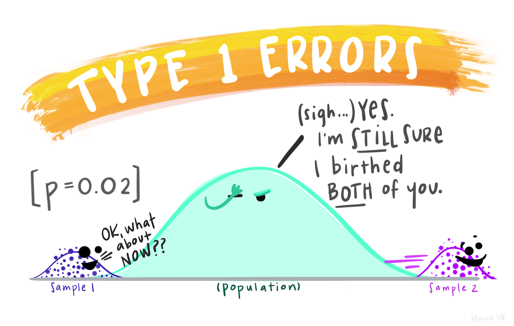
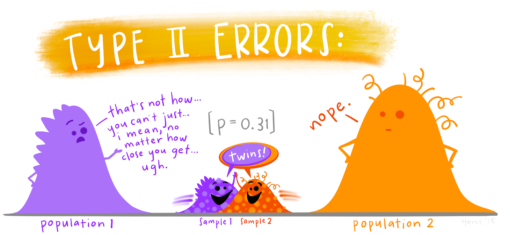

# Tests of significance

## Introduction

## Null hypothesis and alternative hypothesis

## Degrees of freedom

## Levels of significance

## Types of error

```{r}

```

```{r}

```

## Significance of means

### One sample and two sample means in large samples (Z-test)