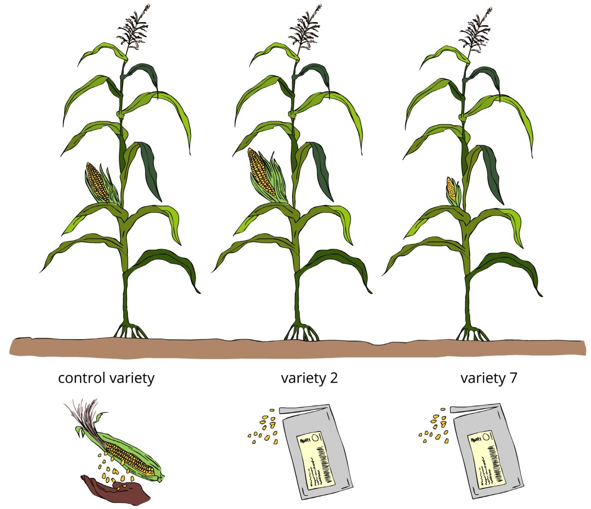

```{r setup, include=FALSE}
library(knitr)
require(tidyverse)
set.seed(453)
# invalidate cache when the package version changes
knitr::opts_chunk$set(tidy = FALSE, echo = FALSE, 
                  message = FALSE, warning = FALSE,
                  out.width = "45%")
options(knitr.table.format = "latex")
options(knitr.kable.NA = "", digits = 2)
options(kableExtra.latex.load_packages = FALSE)

# set penalty for using scientific notation at 10, and number of digits to use in notation to 10
options(scipen = 30, digits = 15)

theme_set(theme_bw())
```

# Principles of field plot experiments

##

\begin{quote}
To call the statistician after the experiment may be no more than asking him to perform a postmortem examination ...\\[1cm]

... he may be able to say what the experiment died of. 

\end{quote}
\hfill \raggedright -- R.A. Fisher, 1938

##

\footnotesize
- A new drug has been tested for its efficacy for control of high blood pressure.
- As a doctor, do you prescribe your patient the drug ?

\bcolumns
\column{0.5\textwidth}

```{r unreplicated-design, out.width="70%", fig.width=5, fig.height=4}

treatment_groups_pressure <- tribble(
  ~"treatment_group", ~"blood_pressure",
  "Control", 90,
  "Treated", 100,
  "Treated", 120,
  "Control", 122,
  "Treated", 110,
  "Control", 102,
  "Treated", 117,
  "Control", 104,
  "Treated", 95,
  "Control", 86,
  "Control", 94,
  "Treated", 98,
)

# Inferences based on a single observations for each of the treatment groups!
treatment_groups_pressure %>% 
  slice(4,9) %>% 
  ggplot() +
  geom_point(aes(x = treatment_group, y = blood_pressure), size = 4, color = "midnightblue") +
  labs(x = "Treatment group", y = "Blood pressure") +
  scale_y_continuous(limits = c(80, 130))
```

\column{0.5\textwidth}

```{r replicated-design, out.width="70%", fig.width=5, fig.height=4}
treatment_groups_pressure %>%
  ggplot(aes(x = treatment_group, y = blood_pressure)) +
  geom_jitter(aes(color = treatment_group),
             size = 2.5, width = 0.1) +
  geom_linerange(aes(ymin = min(blood_pressure),
                     ymax = max(blood_pressure),
                     x = treatment_group)) +
  labs(x = "Treatment group", y = "Blood pressure")
```

\ecolumns

## Replication

- The repetition of experimental conditions so that the effects of interest can be estimated with greater precision and the associated variability can be estimated.
- Experiments make use of replication when they contain multiple \alert{trials} that are executed under circumstances that are nominally\footnote[frame]{Refers to the degree of experimental control that can actually be exerted in the study} identical.
- Within this degree of attainable control, replication effectively reduces the random variation or noise in the comparisons examined in the analysis, and provides an opportunity to estimate the typical size of this random component in individual measurements.

##

- "replication" versus "repeated measurements."
  - For example, suppose four subjects are each assigned to a drug and a measurement is taken on each subject. The result is four independent observations on the drug. This is "replication." On the other hand, if one subject is assigned to a drug and then measured four times, the measurements are not independent. We call them "repeated measurements."
  - variation in repeated measurements taken at the same time reflects the variation in the measurement process, 
  - variation in repeated measurements taken over a time interval reflects the variation in the single subject’s response to the drug over time.

##

- How many replicates are enough ?
  - Generally, the more, the better!
  - Easier to differentiate similar means
  - Better assessment of variation within plot area
- But consider:
  - land constraints,
  - time constraints,
  - material (chemical, planting materials, etc.) constraints,
  - budgetary constraints
- There are several simulation studies related to replication
  - For single trials, eg. foliar fungicide programs at least 4 replicates are often recommended
  - For soil borne diseases, including nematodes, 5-6 replications are preferred owing to uneven distribution of organisms in the soil
- There is a compromise between precision and cost.
- What if replication is prohibitive ?
  - Augment the trial


## Blocking 

\footnotesize
- If a potential source of systematic variation is known, the experiment can sometimes be designed in blocks to minimize its effect.
- Experiment involves the application of treatments to experimental units to assess the effects of the treatments on some response.
- The "\alert{experimental units}," which may be subjects, materials, conditions, points in time, or some combination of these, will be variable and induce variation in the response. Such variation in experimental units may be intentional, as the experimental conditions under which an experiment is run should be representative of those to which the conclusions of the experiment are to be applied.
- For inferences to be broad in scope, the experimental conditions should be appropriately varied.
- In this regard, blocking\footnote[frame]{Blocking an experiment involves dividing, or partitioning, the experimental units into groups called blocks in such a way that the experimental units in each block are intended to be relatively similar, so that treatments assigned to experimental units in the same block can be compared under relatively similar experimental conditions.} mainly serves two purpose: 
  \begin{itemize}
  \scriptsize
  \item Control and adjust for some of the variation in experimental units, hence increase the precision by grouping together a set of experimental units that are more or less homogeneous.
  \item Increase convenience, to allow different sizes of experimental units, link an insurance policy against disturbances that may or may not arise during the course of an experiment.
  \end{itemize}

## Addressing heterogeneity through blocking

```{r blocking-how-to, out.width="95%", fig.align='center'}
# pdftools::pdf_convert("~/../Desktop/ddhakal/training-contents/Participatory plant breeding/Santosh Shrestha/Illustrated Field Guide - Module 1 on plot design for PVS_revised.pdf", pages = 9, filenames = "./images/blocking_concept.png", format = "png", dpi = 250)


```


## Randomization

- The purpose of randomization is to prevent *systematic and personal biases* from being introduced into the experiment by the experimenter.

<!-- A random assignment of subjects or experimental material to treatments prior to the start of the experiment ensures that observations that are favored or adversely affected by unknown sources of variation are observations "selected in the luck of the draw" and not systematically selected. -->

- Lack of a random assignment of experimental material or subjects leaves the experimental procedure open to \alert{experimenter bias}.
  - a horticulturist may assign his or her favorite variety of experimental crop to the parts of the field that look the most fertile,
  - a medical practitioner may assign his or her preferred drug to the patients most likely to respond well.
- The preferred variety or drug may then appear to give better results no matter how good or bad it actually is.

##

- Consider an experiment to compare the effects on blood pressure of three exercise programs, where each program is observed four times, giving a total of 12 observations. Now, given 12 subjects, imagine making a list of all possible assignments of the 12 subjects to the three exercise programs so that 4 subjects are assigned to each program. (There are $\frac{12!}{(4!4!4!)}$, or 34,650 ways to do this.) If the assignment of subjects to programs is done in such a way that every possible assignment has the same chance of occurring, then the assignment is said to be a completely random assignment.
- A random assignment in experimental design is achieved through a random number generator or a random number table.

<!-- A random number generator is a computer program that gives as output a very long string of digits that are integers between 0 and 9 inclusive and that have the following properties. All integers between 0 and 9 occur approximately the same number of times, as do all pairs of integers, all triples, and so on. Furthermore, there is no discernible pattern in the string of digits, and hence the name "random" numbers. -->
- The most common random number generators on computers or calculators generate n-digit real numbers between zero and one. Single digit random numbers can be obtained from an n-digit real number by reading the first digit after the decimal point. Pairs of digits can be obtained by reading the first two digits after the decimal point, and so on.

## Randomization: An Exercise in Spreadsheet 

```{r random-generation, out.width="45%", fig.align='center'}

```

## Comparison and local control

- Experiments are controlled so as to isolate the differences between the treatments of interest, and to minimize extraneous variability so as to enable the sharpest possible statistical analyses (e.g., narrow confidence intervals or powerful tests).
- In many instances, this high degree of control means that the data collected are actually representative of only a very special situation, reflecting the particular laboratory procedures, batch of experimental material, et cetera, used in the performance of the experiment. As a result, meaningful inferences usually need to be based on comparisons within an experiment, with the idea that anything unusual, but common, to all trials in the experiment will "cancel out" in the analysis.

##

\begin{columns}[T, onlytextwidth]
\column{0.6\textwidth}
\begin{itemize}
\item "Comparison" often leads to the inclusion of one or more experimental controls.
  \begin{itemize}
  \footnotesize
  \item For example, in addition to the four carefully defined "experimental treatments", while evaluating pipeline varieties, one or two "locally adapted" cultivars are included so as to provide a comparison to what might have happened in a "normal" scenario or how would the "local check" perform in controlled experimental conditions.
  \end{itemize}
\item A large difference between responses form these treatment and "checks" could indicate unanticipated influences of the experimental procedure \textit{per se}; a small or negligible difference might be viewed as support for the investigators' intent that "checks" are a reasonable representation for genotypes suited to the target environment.
\end{itemize}
\column{0.4\textwidth}

```{r local-control, out.width="98%", fig.align='center'}

```

\end{columns}

<!-- In an experiment involving the growth of cell cultures in response to hormone exposure, the control might consist of cultures grown without the addition of any hormones, while the more interesting cultures would be grown in the presence of one or more hormones at specified concentrations. Control and comparison are two experimental devices used to reduce sources of variability that are uninteresting or irrelevant in the context of the questions being asked. -->

# Interpretation of results

## Interpretation of results

- Design of experiments enable uniformly control (or adjustment) of environmental factors that are not a part of the treatments being evaluated. 
- This uniformity is both an advantage and a weakness of a controlled experiment. 
- Clearly the result of an experiment is, applicable only to conditions that are the same as, or similar to, that under which the experiment was conducted. 

##

\begin{columns}
\column{0.8\textwidth}
A glass could be:
\begin{itemize}
\footnotesize
\item Half full (optimist)
\item Half empty (pessimist)
\item Twice as big as it needs to be (project manager)
\item Half the required amount of liquid for it to overflow (realist)
\end{itemize}
Idiosyncrasies:
\begin{itemize}
\footnotesize
\item How it can be half full or half empty ? FULL is \alert{FULL} and EMPTY is \alert{EMPTY}.
\item If completely full, \alert{half with air and half with water}.
\item Only optimistic can \alert{see half empty}, how can they be a pessimist ?
\item Half full could be the answer, if you think you have \alert{enough} there.
\item Half empty could be the answer, if what you have is \alert{not sufficient}.
\end{itemize}
\column{0.2\textwidth}

```{r, out.width="80%"}

```

\end{columns}

# Bibliography

## References
